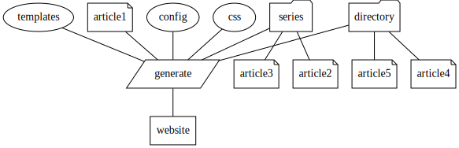

> ⚠️ Note: This repository contains **stbl2**, a Rust rewrite of stbl.
> The current implementation is under active development.
> Some documentation below describes the original C++ version and is being updated incrementally.

## stbl2 (Rust) CLI

Common commands:
- `stbl_cli scan` (walk content and parse headers, no writes)
- `stbl_cli plan` (generate a build plan without executing)
- `stbl_cli build` (build the site)
- `stbl_cli verify` (validate config and content; use `--strict` to fail on warnings)
- `stbl_cli clean` (remove cached outputs and database for the site)

Build options:
- `stbl_cli build --jobs <N>` (control parallelism for image scaling; video tasks run at roughly `N/4` concurrency, ffmpeg is limited to 4 threads per task)
- `stbl_cli build --regenerate-content` (rebuild all non-media outputs, ignoring cache for pages/feeds/assets)
- `stbl_cli build --precompress=false` (disable generating `.gz` for text assets)
- `stbl_cli build --fast-compress` (use gzip level 1 and skip brotli for precompression)
- `stbl_cli build --preview` (serve output locally, do not open a browser)
- `stbl_cli build --preview-open` (serve output locally and open a browser)


# Introduction to stbl

stbl is an acronym for "Static Blog".

## What is does

It reads files in a special directory structure and generates a static web site.



The directory contains some special files, like CSS and templates for generating the
HTML code, a configuration file specific to the site (blog), and directories containing
one file in markup format for each article (post).

## Design Goals

These are the design-goals / primary requirements for the project.

- Creates responsive web-sites "out of the box" for an optimal desktop and mobile user experience.
- Simple to use, frictionless when blogging.
- Command line program, so that blogs can be generated anywhere.
- Few dependencies. Avoid pulling in tons of code to do trivial things.
- Use Markdown for writing.
- Easy to display code snippets, like on github.
- Generate the html code from templates to allow maximum flexibility.
- Fast "time to market" - keep the architecture and code simple.
- Free from javascript. (JavaScript can be used by sites generated by the program, but it is not required).
- Generates static HTML5 websites that can be served by any HTTP server.
- RSS feeds

## Other features
- Support for video (without any javascript)
- [SEO friendly](https://lastviking.eu/stbl_and_seo.html)
- Easy to [integrate with Google Analytics](https://lastviking.eu/stbl_and_google_analytics.html) and similar services.
- Easy to add [commenting with Disqus](https://lastviking.eu/stbl_with_disqus.html).
- Easy to add [Commenting with IntenseDebate](https://lastviking.eu/stbl_with_intensedebate.html).

## Why

I like to write. I failed to find an existing tool that did the publishing job for me. I tried several popular approaches (like Drupal and Jekyll), but got nowhere. So I decided to spend
a few days making my own program to [get it right](https://lastviking.eu/modern_blogging/index.html).

# License

GPL-3 license. It is Free. Free as in speech. Free as in free air.

# How to build

The source code is now in C++ 20. It should compile with any recent C++ compiler.
The project use CMake.

## Dependencies

System dependencies:
- boost libraries >= 75
- libjpeg library

CMake included projects
- lest Unit test framework

Git submodules
- cpp-markdown (To do the heavy lifting for markdown processing)

## Linux

In order to build, clone the project. Then:

```sh
    sudo apt install libjpeg-dev libboost-all-dev libcmark-gfm-dev
    git clone https://github.com/jgaa/stbl.git
    cd stbl
    git submodule update --init
    mkdir build
    cd build
    cmake -DCMAKE_BUILD_TYPE=Release ..
    make -j `nproc`
    sudo make install
```

# How to use

## File structure

The top directory of a site has this layout:

- articles (Directory for content)
- artifacts (Directory for css, icons, logos etc.)
- files (Optional directory where you can put files you want copied to your website).
- images (Optional directory for images you refer to in your documents)
- video (Optional directory for videos you refer to in your documents)
- templates (Templates to generate the pages in the static site)
- stbl.conf (Site specific configuration)

## Articles

In the articles folder, you can organize articles in a mix of:

- Text files in the articles folder itself. These are interpreted as normal articles (blog posts).

- Text files in subfolders with names starting with an underscore. These are also
  interpreted as normal blog posts. The folders are just a convenience for you to
  organize your posts. For example by subject, year, year+month, or any other
  association that makes sense to you. You can add subdirectories like these in as
  many levels as you wish. However, remember that it’s usually best to keep things simple.
  

- Textfiles in sub-folders *not* starting with an underscore. These are interpreted as a series of related posts. The name of the directory will be listed on your main page as the name of the series, and the posts will be listed in chronological order. (RSS feeds will list the newest articles first).

The articles consist of a header section, and then the actual content. The content
is parsed as Markdown text. This makes it very simple to focus on writing, and
still get nice, structured web pages.

An example:

```text
    ---
    author: jgaa
    tags: example, html, testing
    ---

    ## Testing HTML
    In order to test HTML, you can use the [Markup Validation Service](https://validator.w3.org/).

    ## Some code

    ```
    for(auto i = 0; i < 3; ++i) {
        cout << "The number is ... " << i;
    }
    ```
```

In this example we have two header directives, the author (me), and then tags.
Then follows the markup.

## Series

One thing that often annoys me with blogs, is that the articles are always
listed newest first. If you have a series of articles on a subject, you
may want your readers to read them chronologically. That way you can
expand the topic little by little, or tell a story in a consistent way.

Stbl will generate a cover page for the articles in a series, and list the
articles in the series chronologically, oldest first.

As noted before, a series is identified by a directory under articles/ not
starting with an underscore. The name of the series is the name of the
folder. Underscores in the name are translated to spaces. The folder name
"the_adventures_of_my_cat" will result in the series name "The adventures of my cat".

## Static content (about, terms of use, policies)

Some pages, like "About" are special in the way that you probably want a link to them
from the menu, rather than having them listed by date.

stbl has a special template for such pages, stripping them of metadata about authors
and tags. You can even add them to the menu right in the article’s header.

Example:

```text
    ---
    menu: About
    template: info.html
    type: info
    ---
    This is just an example / template for a site generated by stbl.

```

## The header Section

The following headers are recognized:

- author: The name of the author of the article. If both authors and author is specified, the author in the 'author' field will appear first among the authors on the generated page.
- authors: A comma-separated list of authors.
- banner: A (preferably high-resolution) image to be used as a banner picture at the top of the article. Stbl will make scaled variants for different screen sizes.
- published: When the article was published: A date in 'YYYY-MM-DD HH:MM' format, or 'no' or 'false' if the article is unpublished. If the value is unset, the system will fall back to the file-date for the article. If the date is set to the future, the article will beheld back1.
Unpublished articles will not be generated. This lets you work on articles long before you
are ready to publish them, by setting the value to "no" or "false".
- comments: Can be <code>no</code>, to disable commenting, or any one of the configured commenting services, for example <code>disqus</code> if you have [configured your site to use Disqus](https://lastviking.eu/stbl_with_disqus.html)
- updated: When the article was last updated. A date in 'YYY-MM-DD HH:MM' format. If unset, the system will fall back to the file-date for the article.
- expires: When the article expired. A date in 'YYY-MM-DD HH:MM' format. If unset, the article will not expire. Expired articles are not published.
- uuid: uuid of the article
- sitemap-changefreq: Sets the changefreq value in the sitemap. One of always, hourly, daily, weekly, monthly, yearly, never. See [the sitemaps XML Tags definitions](https://www.sitemaps.org/protocol.html#xmlTagDefinitions).
- sitemap-priority: A value from 0 to 100, where 100 is then highest search range priority for this page. This can be set individually on articles and series cover pages.
- title: Title of the article. If not specified, the title is deduced from the file-name.
- tags: A comma-separated list of tags.
- abstract: A short abstract of the article, for use in the list of articles.
- template: Template to use when rendering the article. The default is "article.html".
- type: "info" if the article is to be held back from listings (like the About page). Default is blank.
- menu: The name of the menu-item that links to the article. This is typically used for special pages like About or Contact etc.
- part: Integer, starting at 1 (one), that can be used in series to sort the articles correctly when the series index-page is displayed in the browser. For stand-alone articles the header is ignored.

## Configuration

The configuration-file "stbl.conf" contains site-wide configuration, like
the language used, authors (with contact information), menu structure, and
some other things. See the [example](examples/default/stbl.conf).

## Colorized source listings.

stbl can colorize your source code listings, via the `chroma` command-line program.
This is actually meant to be a library, but it's written in the programming language `go`
and can't be used as a library by stbl. It does however also come as a command line
program, and *that* stbl can use. 

To use colorizing, download a [release of chroma]( https://github.com/alecthomas/chroma/releases)
and copy the chroma command somewhere in your PATH (for example `/usr/local/bin` under Linux)
or just specify the full path in `stbl.conf` in the *chroma* section.

## Embedded videos

Videos can be embedded using this syntax:
```

```
The video scale is optional and defaults to *p720*.
The following scales are supported:
- p360
- p480
- p720
- p1080
- p1440
- p2160

This feature requires *ffmpeg* to be installed on the machine. stbl
uses ffmpeg to scale and prepare the video.

The original videos must be copied to the *video* folder before stbl is run.

### Upgrade from a version before 0.13

This feature was added in stbl version 0.13. If you are using a site initialized with 
an older version, you can add a chroma section to `stbl.conf

```conf
; https://github.com/alecthomas/chroma
; Currently, you must download this app from https://github.com/alecthomas/chroma/releases
;   and copy the `chroma` program to an appropriate location.
chroma {
    ; enabled. One of: true|false|auto
    ; If `auto`, chroma will be used if the application is available.
    enabled auto
    style friendly
    ; path /usr/local/bin/chroma
}
```

You should also update the *code* style in `artifacts/default.css` to:

```css
pre code {
    display: block;
    padding:1%;
    margin: 1%;
    border-style: dotted;
    border-color: black;
    border-width: 0.05rem;
    width: 96%;
    overflow-x: auto;
    margin-bottom: 2rem;
}
```

Set the colors to match your site’s theme.

## Templates

The templates are snippets of html code with macros that are expanded during rendering.

- article-in-compact-list.html: Defines how to show a single article in a compact list of articles.
- article-in-list.html: Defines how to render the code for an article in a list of articles.
- article.html: Defines how to render the code for an article
- author.html: Defines how to render the code for an author
- compact-article-list.html: Defines the output for the `@&#91;blogitems&#93;()` macro.
- footer.html: Defines how to render the page-footer
- frontpage.html: Defines how to render the front-page
- info.html: Defines how to render special pages, like About
- menu.html: Defines how to render the menu
- menuitem.html: Defines how to render a menu-item
- next.html: The html-code to link to the next page.
- page-header.html: Defines how to render the page header (html / head entity)
- prev.html: The html-code to link to the previous page.
- pubdate.html: Defines how to render the date of publication
- pubdates.html: Defines how to render the date of publication and the update date (if the article is updater after it was published).
- series.html: Defines how to render the cover-page for a series.
- site-header.html: Defines how to render the top of the page - logo, menu, site-abstract.
- social-handle.html: Defines how to render a social handle for an author
- social_handles.html: Defines how to render the list of social handles for an author
- submenu.html: Defines how to render a sub-menu (not yet fully supported)
- tag.html: Defines how to render a tag in a list of tags.
- tags.html: Defines how to render a list of tags.
- updatedate.htm: Defines how to render the updated date, including the labeling text.

The templates have the following macros available, wrapped in {{ }}.

- abstract: The abstract of the article
- author: The author(s) of an article
- authors: Alias for author
- banner: html5 picture element with scaled images for different screen sizes.
- comments: html and/or jacascript code for comments on an article.
- content: The content of an article.
- expires-ansi: Ansi-date when the article expires.
- expires: The time the article expires
- expires: The time the article expires.
- if-next: The template next.html expanded, if there is a next page.
- if-prev: The template prev.html expanded, if there is a previous page.
- if-up: The template up.html expanded, if this is an article in a series.
- if-updated: Updated date, including the "Updated label - defined in template updatedate.html) if the article as updated after is was published. If not, this macro is empty.
- lang: The language for the site, typically used as &lt;html lang={{lang}}&gt;
- list-articles: A list of articles to be placed in a series cover-page or frontpage. Only available when rendering these special pages.
- menu: The rendered code fot the menu.
- next: The relative path to the next page (if the front-page is generated over several pages).
- now: The current date (when the site was rendered).
- page-url: Full url to the current page
- prev: The relative path to the previous page (if the front-page is generated over several pages).
- program-name: The name of the generator (stbl).
- program-version: The version of the generator.
- pubdate: Published date, including the "Published label - defined in template pubdate.html)
- pubdates: Expansion of the pubdates.html template. This is what you will normally use in an article to show when it was published ant updated.
- published-ansi: Ansi-date when the article was published.
- published: The time the article was published.
- published: The time the article was published.
- rel: Relative path to the root of the site. Enables relative links in the templates.
- rss-abs: Full url to the rss feed for the page (currently only for the front page).
- rss: Relative link to rss feed for the page (currently only for the front page).
- site-abstract: The abstract (or slogan) of the site (from stbl.conf).
- site-title: The title of the site (from stbl.conf).
- site-url: The fully qualified url to the site (from stbl.conf).
- tags: The list of tags for the article
- title: The title of the article or series
- up: Link to the series fir articles that are part of a series
- updated-ansi: Ansi-date when the article was updated.
- updated: The time the article or series was updated.
- updatedate: Updated date, including the "Updated label - defined in template updatedate.html)
- url: The relative url to the article or series.
- uuid: The unique identifier for an article.

## Macros
Macros can be used in Markdown documents to inject content. Macros have the form `@&#91;name&#93;(optional args...)`.

Example: `@&#91;blogitems&#93;(items=5)` will list the 5 newest blog posts in an unordered list (using the default templates).

Macros: 
- **blogitems** — shows a list of the latest blog posts. Args: items=*n* where *n* is the number of items to list. Default is 3.
- **tags** — renders tags for the current page. Args: style=inline|pills (default inline), prefix="Tags:" (optional), sort=site|alpha (default site). Example: `@&#91;tags&#93;(style=pills, prefix="Tags:", sort=alpha)`.
- **series** — renders series navigation for the current page (when part of a series). Args: nav=true|false (default true), list=true|false (default false), title="Series" (optional). Example: `@&#91;series&#93;(list=true)`.
- **related** — shows related posts based on tags and/or series. Args: items=5 (default 5), by=tags|series|both (default both), title="Related" (optional). Example: `@&#91;related&#93;(items=3, by=tags, title="More like this")`.

## How to create a new blog

The easiest is to let stbl bootstrap a project, and then just edit the config file and start blogging.

```sh
~$ mkdir myblog
~$ cd myblog
~$ stbl --init
[2017-11-30 09:54:58.061377] [0x00007ffa0a6c5b80] [info]    Initializing new site: "/home/jgaa/myblog"
~$ ls
articles  artifacts  files  images  video  stbl.conf  templates

```

Then, when you are ready, you can generate the site.
```sh
~$ stbl -s ~/myblog -d /tmp/myblog --open-in-firefox
```

If you experience any problems, please open an [issue](https://github.com/jgaa/stbl/issues).

## Examples

To generate the example site that is included in the git repository, and open it in firefox, showing debug-messages on the console:
```sh
$ stbl --open-in-firefox --console-log debug  --source-dir ~/src/stbl/examples/default
```

Note that you have to point the --source-dir option to where the examples/default folder is on your file-system.

## Blog posts about stbl

- All blog posts tagged with *stbl* from [lastviking.eu](https://lastviking.eu/_tags/stbl.html)

Please open an issue if you know about a blog-post or an article about stbl you would like to see in this list.
